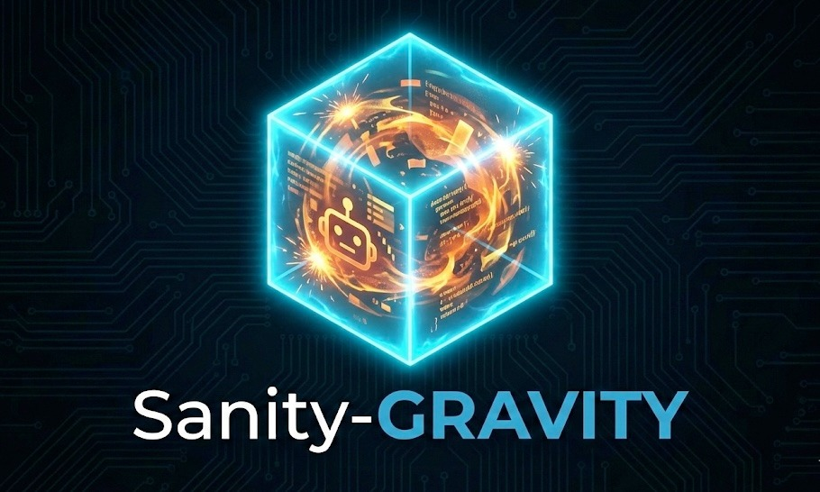

# Sanity-Gravity: The Antigravity Sandbox

<p align="center">
  
</p>

[English](README.md) | [繁體中文](README_zh-TW.md) | [日本語](README_ja.md)

**Sanity-Gravity** 是一個專為 **Agentic AI IDEs** (如 Google Antigravity) 設計的安全、容器化沙箱環境 (Sandbox)。它的目的是將 AI 代理的活動限制在一個可拋棄的 Docker 容器內，將執行風險降至最低，同時提供完整的圖形桌面體驗。

## 演示 (Demo)

📺 **觀看演示影片**: [YouTube Link](https://youtu.be/x0DGKuHyx2A)

## 為什麼選擇 Sanity-Gravity?

*   **🛡️ 安全至上 (Safety First)**: 隔離「AI 自主執行」帶來的風險。如果 AI 代理執行了 `rm -rf /` 或惡意代碼，只有容器會受影響，您的本機主機毫髮無傷。
*   **🖥️ 完整圖形桌面 (Full Desktop GUI)**: 內建 **Ubuntu 22.04 + XFCE4** 與 **KasmVNC**，讓 AI 代理能像真人一樣自然地操作瀏覽器 (Chrome) 和 GUI 應用程式。
*   **🚀 零配置 (Zero Config)**: 預先安裝了 **Antigravity IDE**、Google Chrome、Git 和必要的開發工具。
*   **🔌 無縫 IO (Seamless IO)**: 自動映射您的主機使用者 UID/GID，防止在掛載工作區時常見的「root 權限地獄」問題。
*   **🧩 支援多重實例 (Multi-Instance Capable)**: 可同時運行多個獨立的沙箱環境 (例如：分別用於開發、測試、生產環境)，並自動處理 Port 分配，互不衝突。

## 快速開始

### 前置需求
*   Docker & Docker Compose (v2.0+)
*   Python 3.7+ (用於 `sanity-cli`)
*   *(選用)* **NVIDIA Container Toolkit** (用於 GPU 加速)

### 安裝

1.  複製專案庫 (Repository):
    ```bash
    git clone https://github.com/shiritai/sanity-gravity.git
    cd sanity-gravity
    ```

2.  建置沙箱環境:
    ```bash
    ./sanity-cli build
    ```

3.  執行 KasmVNC 版本 (推薦):
    ```bash
    ./sanity-cli run -v kasm --password mysecret
    ```

4.  **存取桌面**:
    打開瀏覽器並前往: **[https://localhost:8444](https://localhost:8444)**
    *   **使用者**: `(您的主機使用者名稱)`
    *   **密碼**: `mysecret` (若未指定，預設為 `antigravity`)

> **注意**: 您可能會看到「自簽署憑證」的警告。這在本地沙箱環境中是正常的，請點擊 "進階" -> "繼續"。

## CLI 使用 (`sanity-cli`)

本專案包含一個輔助腳本 `sanity-cli` 來管理生命週期:

```bash
./sanity-cli list           # 列出可用版本
./sanity-cli build [name]   # 建置特定版本 (預設: all)
./sanity-cli run -v [name] [options] # 執行特定版本
  # 選項:
  #   --password [pwd]    (設定 SSH/VNC 密碼, 預設: antigravity)
  #   --ssh-port [port]   (預設: 2222)
  #   --kasm-port [port]  (預設: 8444)
  #   --vnc-port [port]   (預設: 5901)
  #   --novnc-port [port] (預設: 6901)
  #   --gpu               (啟用 NVIDIA GPU 支援)
  #   --skip-check        (跳過前置檢查)
  #   --workspace [path]  (設定自訂工作區路徑, 預設: ./workspace)
  #   --name [name]       (設定多重實例的專案名稱, 預設: sanity-gravity)

./sanity-cli up -v core     # 建立並啟動容器 (別名: run)
./sanity-cli down           # 停止並移除容器
./sanity-cli stop           # 停止容器 (保留資料)
./sanity-cli start          # 啟動已停止的容器
./sanity-cli restart        # 重啟容器
./sanity-cli status         # 檢查容器狀態
```

### 設定同步 (Configuration Sync)

`sanity-cli` 會自動偵測並同步設定檔至容器中，提供無縫的使用體驗。

1.  **專案級設定**: 在專案根目錄建立 `config/` 資料夾，並放入 `GEMINI.md` 或 `settings.json`。
2.  **互動式初始化**: 若偵測不到設定，CLI 會詢問是否要從主機 (`~/.gemini/`) 複製或建立空白設定。
3.  **自動同步**: 每次啟動時，檔案會自動複製進容器 (`~/.gemini/`)，確保環境設定始終保持最新。

### 🔑 Git Context 共享

Sanity-Gravity 會自動偵測並與容器共享您主機的 Git 設定與 SSH 金鑰 (透過 Agent Forwarding)。這讓您可以在**不暴露私鑰**的情況下，於容器內無縫地使用 `git`。

**準備工作 (Prerequisites):**

1.  **Git 設定**: 確保您的主機上有 `~/.gitconfig`。
2.  **SSH Agent**: 確保您的 SSH Agent 正在執行，且已加入金鑰：
    ```bash
    # 啟動 Agent (若尚未執行)
    eval $(ssh-agent)
    # 加入您的金鑰 (例如 id_ed25519 或 id_rsa)
    ssh-add ~/.ssh/id_ed25519
    ```

當您執行 `./sanity-cli up` 時，它會自動偵測 Agent 並轉發 Socket。

### 🧩 多重實例支援 (Multi-Instance)

**需要並行處理多個任務？** Sanity-Gravity 支援同時運行多個完全隔離的沙箱實例。只需透過 `--name` 參數指定不同的專案名稱即可。

```bash
# 啟動名為 'dev-02' 的第二個實例
./sanity-cli up -v core --name dev-02 --workspace /tmp/dev02
```

**零衝突保證**：當使用自訂名稱時，`sanity-cli` 會自動偵測並分配可用的隨機 Port，您無需擔心 Port 衝突問題。分配到的 Port 會清楚地顯示在輸出資訊中。

若要停止或查看特定實例的狀態：

```bash
./sanity-cli status --name dev-02
./sanity-cli stop --name dev-02   # 暫停 (保留資料)
./sanity-cli down --name dev-02   # 銷毀 (移除容器)
```

## 版本選擇 (Variants)

| 版本 (Variant) | 技術堆疊         | 最佳用途            | 存取方式                                   |
| :------------- | :--------------- | :------------------ | :----------------------------------------- |
| **`kasm`**     | KasmVNC          | **Web 桌面 (推薦)** | `https://localhost:8444`                   |
| **`vnc`**      | TigerVNC + noVNC | 傳統 VNC 客戶端     | `localhost:5901` / `http://localhost:6901` |
| **`core`**     | SSH Only         | 無周邊 / 終端機代理 | `ssh -p <port> developer@localhost`        |

## SSH 存取

所有版本，**包含 GUI 版本** (Kasm/VNC)，預設都啟用了 SSH。這能實現強大的混合工作流：

*   **Headless 控制**: 無需打開桌面即可透過 CLI 自動化 GUI 工具。
*   **通訊埠轉發 (Port Forwarding)**: 將容器內的 Web 應用或除錯器轉發到主機 (例如 `ssh -L 3000:localhost:3000 ...`)。
*   **檔案傳輸**: 使用 `scp` 或 `sftp` 輕鬆移動建置產物。
*   **遠端開發**: 當 Agent 在沙箱中執行時，您可以使用本機的 VS Code / JetBrains IDE 透過 SSH 連線進行舒適的 Coding。

**預設通訊埠**: `2222` (可透過 `--ssh-port` 設定)
**憑證**: 使用者 `(您的主機使用者名稱)` / 密碼 `antigravity` (或自訂)

```bash
# 範例: 連線到 Kasm 版本
ssh -p 2222 developer@localhost
```

## 專案結構

專案佈局的快速總覽：

```text
sanity-gravity/
├── sanity-cli          # 🛠️ 主要 CLI 入口 (Python 腳本)
├── sandbox/            # 📦 Docker 建置環境與設定
│   ├── variants/       #    - 各版本的 Dockerfile (core, kasm, vnc)
│   └── rootfs/         #    - 共用的 overlay (腳本, 設定檔)
├── tests/              # 🧪 Pytest 整合測試套件
├── workspace/          # 📂 掛載的使用者目錄 (持久化資料)
└── .github/            # 🐙 CI/CD 工作流與 Issue 模板
```

## 命名由來 (What's in a Name?)

> **"Sanity-Gravity"** 的寓意：為狂野的 **Antigravity** (反重力/AI 代理) 世界提供一股強大的 **Gravity** (重力/約束)，以維護開發者的 **Sanity** (理智)。

*   **Sanity (理智)**: 讓您的主機環境保持「正常」。透過將不可預測的 Agentic AI 執行限制在可拋棄的容器中，我們防止了意外破壞 (例如 `rm -rf /`) 和設定污染。
*   **Gravity (重力)**: 為 **Antigravity** 系統提供一個「接地」的執行環境。它給了飄浮的 AI 代理一個具體的著陸點，讓它們能在物理法則（隔離）的約束下與工具互動並影響世界。

## 授權 (License)

本專案採用 **Apache License 2.0** 授權。詳情請見 [LICENSE](LICENSE)。
